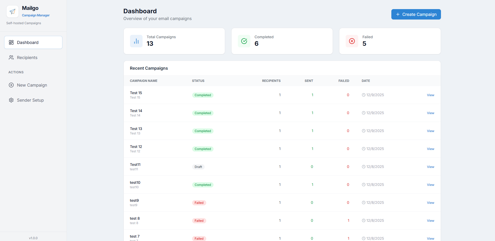

# Mailgo - Local Email Campaign Tool

Local-first email campaign manager with an ASP.NET Core API (SQLite + EF Core), a React dashboard, and an optional Electron desktop shell that bundles both.

<p align="center">
  
</p>

## Table of Contents
- [Overview](#overview)
- [Quick Start (web)](#quick-start-web)
- [Desktop (Electron)](#desktop-electron)
- [Docker Compose](#docker-compose)
- [Docs](#docs)
- [Repository Layout](#repository-layout)

## Overview
- Web UI built with Create React App + TypeScript; API built with ASP.NET Core + EF Core (SQLite).
- SMTP credentials are only provided at send time; nothing sensitive is persisted server-side.
- Choose your runtime:
  - Web/Docker: run the API and CRA build behind Nginx.
- Desktop: Electron wrapper that ships the CRA build and backend together.

## Downloads (Windows x64)
- Prebuilt desktop installer (Windows x64): see `binaries/mailgo-<version>-win-x64.exe`. These builds are produced on/for Windows x64 (my test machine). Other platforms will follow as I can test them; PRs are welcome.

## Quick Start (web)
1. API
   ```bash
   cd backend
   dotnet restore Mailgo.sln
   dotnet run --project src/Mailgo.AppHost/Mailgo.AppHost.csproj
   ```
   - Launch profile binds to `http://localhost:8080` (and `https://localhost:8443`) by default; override with `ASPNETCORE_URLS`.
   - SQLite defaults to `data/app.db` under the build output; set `ConnectionStrings__Default` to point elsewhere.
2. Frontend
   ```bash
   cd frontend/app
   npm install
   REACT_APP_API_BASE_URL=http://localhost:8080/api npm start
   ```
   - CRA dev server runs on `http://localhost:3000`.
   - Persist settings in `frontend/app/.env.local` (`REACT_APP_` prefix required).

## Desktop (Electron)
- Location: `desktop/` (uses the same CRA build and backend binaries).
- Prerequisites: Node 20+, .NET 10 SDK.
- Dev (starts CRA, backend `dotnet watch`, and Electron pointing at the dev server):
  ```bash
  cd desktop
  npm install
  npm run dev
  ```
- Build installer (bundles frontend build + published backend, outputs to `desktop/out/`):
  ```bash
  cd desktop
  npm install
  npm run build
  ```
  - Backend listens on `http://localhost:8080/api` inside the desktop app; SQLite lives in your OS user data folder.
  - See `docs/electron/README.md` for structure, ports, and troubleshooting.

## Docker Compose
```bash
cd infra
docker compose up --build
```
- `api` (ASP.NET Core) on `localhost:8080`
- `web` (CRA build served via Nginx) on `localhost:3000`, proxying `/api`
- SQLite data persisted in `../data`

## Docs
- Electron/Desktop guide: `docs/electron/README.md`
- Backend notes: `backend/README.md`
- Frontend notes: `frontend/app/README.md`
- Infra/compose notes: `infra/README.md`
- Media assets (screenshots/logos): `docs/media/`

## Repository Layout
- `backend/` - .NET solution (`Mailgo.sln`), API + domain projects, backend Dockerfile
- `frontend/` - CRA dashboard source (`app/`), frontend Dockerfile, UI tests
- `desktop/` - Electron shell, build scripts, and packaging configuration
- `infra/` - `docker-compose.yml` plus deployment-facing docs
- `docs/` - desktop guide and shared media assets
- `data/` - local SQLite files mounted into containers (gitignored)
- `scripts/` - shared automation entry points (currently placeholder)
- `recipient-sample.csv` - CSV format reference for recipient imports
